# Virtual Network Embedding Problem Approximation

## Code documentation

* [vnep-approx](/vnep-approx/)
* [alib](/alib/)

# Methodology

In contrast to much prior work on VNEP which focuses on a single request,
perhaps embedded one after another in an online fashion, the goal of our
evaluation is to study the performance across several dimensions, including
number of considered requests, but also the scarcity of edge or node resources.
In particular, we consider the cross product of 6 parameter sets to obtain 2250
different generation parameters overall. The considered parameter space allows
us to investigate the performance under different loads and also to draw
inferences with respect to the scalability of randomized rounding.

To generate a single VNEP instance under any combination of parameters
listed in the table below, we proceed as follows. We use real-world substrate topologies contained in
the [Topology Zoo](http://www.topology-zoo.org/) of ISPs or research-networks. The
selected networks contain roughly between 40 and 50 nodes and between
90 and 120 edges. We only consider a single type of node functionality
(e.g. the type 'x86 server'). The capacity of the substrate nodes
(for this single type) and of the substrate edges is set to 100.0.

Given such a substrate, we generate requests as follows. We consider three different 
probability distributions for requests, yielding between 3 and 10 virtual nodes.
The distributions differ in the expected number of nodes (and accordingly edges):
we first construct a directed tree and then add additional edges as long as the 
cactus graph property is not violated. 
For each of the virtual nodes, we allow the mapping onto 20% or 30% of the nodes.

To control and induce different node and edge loads, we make use of the so called 
node and edge _resource factors_. Intuitively, their meaning is as follows. 
Under the assumption that all (already generated) requests _will_ be embedded, 
the average (expected) node load shall equal node resource factor. To assign node 
loads according to this factor, we first compute the expected number of virtual 
nodes and divide the available substrate capacities by this number. Scaled by the
 _node resource factor_, we set this to be the _expected_ demand for a 
 single virtual node. For each request, we draw the demand _for all_ its 
 virtual nodes from the exponential distribution with this expected value. 
 The edge resource factor is used in a similar fashion. Given the expected number 
 of virtual edges for the requests, an edge resource factor of 2.0 will 
 set virtual edge demands, such that if each virtual edge 
spans exactly 2 substrate edges, the expected load on any substrate edge would 
be 100%. Note that we also consider edge resource factors smaller than 1, 
as virtual nodes may be collocated on the same substrate node, hence being 
connected by a path of length 0. Furthermore, the virtual edge demands
 are not drawn from the exponential distribution at random but scaled 
 according to the chosen virtual node demands. Hence, the edge load is 
 directly proportional to the node load.

Lastly, to choose meaningful profits for the requests which reflect the actual 
resources required for embedding the respective request, we a priori compute a 
minimal cost embedding in the absence of any other request. This computation is 
normally very quick (less than one second). As cost metric, we a priori assign 
to each edge a cost proportional to the _geographical_ distance of the 
incident nodes. Then we norm the costs of the substrate nodes, such that using 
up all the edges' capacities is exactly as expensive as using up all the nodes' 
capacities. Hence, both resource types are of equal worth.

We have implemented all henceforth presented algorithms using Python 2.7. For 
solving Integer and Linear Programs we make use of the commercial solver 
Gurobi 6.5.2.

## Overview of scenario generation parameters

| Parameter             | Values                            |
|----------------------:|-----------------------------------|
| Topology              | \{BellCanada, Geant, Uunet\}      |
| Number of Requests    | \{25, 50, 75, 100, 125\}          |
| Exp. number of nodes  | \{5, 6, 7\}                       |
| Neighborhood Size     | \{0.2, 0.3\}                      |
| Node Resource Factor  | \{0.2, 0.4, 0.6, 0.8, 1.0\}       |
| Edge Resource Factor  | \{0.25, 0.5, 1.0, 2.0, 4.0\}      |

## Scenario Validation

Let us first provide some insights into the spectrum and
properties of the scenarios used for our explorative study.
In particular, we first study the results yielded by the (near-optimal) 
Integer Program, to highlight the diversity of the considered scenarios. 
To this end, and as we will compare the randomized rounding solutions to 
the baseline IP solutions, we have implemented the classic multi-commodity 
flow IP and solve it using Gurobi with a time limit set to 2400 seconds.

The figure below gives an overview on the solutions 
obtained by generating 2250 instances according to the above detailed 
generation procedure: The top left plot shows the averaged (absolute)
number of requests, for which an embedding existed in the first place.
This number is a side product of the a priori computation of the profit 
for each single request. If a request cannot be embedded at all (in the 
absence of other requests), the IP yields an infeasibility certificate 
and we can discard the request.
The right plot in the top row depicts the relative number of accepted 
requests with respect to the number of feasible requests. The left plot in the 
second row depicts the optimality gap achieved by the Integer Program. 
Concretely, a value of 16.3% means that the found solution could (at best) 
be improved by 16.3%. The necessary upper bound for this objective gap is 
derived from the linear relaxations during the execution. While Gurobi could 
solve some instances to optimality, most IP executions were terminated when 
the time limit was reached.

In the third and fourth row, the average / maximal loads of each scenario for 
nodes and edges respectively are depicted. Concretely, for a scenario the maximal 
and average load on the respective resource is computed and then averaged 
over the 90 instances depicted in a square. Note that the average node 
load rises proportionally with the node resource factor and that at least 
one node resources is nearly completely used for the upper triangle of 
parameter combinations. The impact of the node resource factor on the 
edge loads is less prominent. Particularly, the (averaged and maximal) 
edge load only slightly varies with different node resource factors. 

Overall, we note that the (near) optimal solutions exhibit diverse node and edge
loads. Clearly, for some parameter combinations the capacities are the 
bottleneck while for other combinations the edge resources are the bottleneck.
Furthermore, the average acceptance ratio varies between 40% when both node 
and edge resources are scarce and approaches 90%, when edge resources are 
not scarce.

## Baseline scenario solutions

Baseline scenario solutions obtained with Integer Program. Each of the heat map squares represents the averaged result of 90 different VNEP instances. Note the different x-axes for the top and the bottom row.

|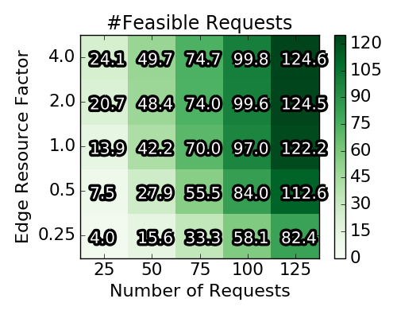 | 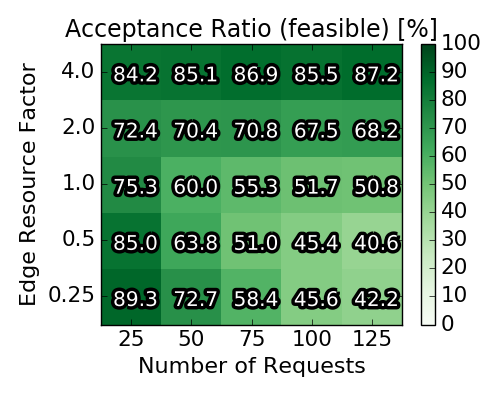 |
|----------------------:|-----------------------------------|
| 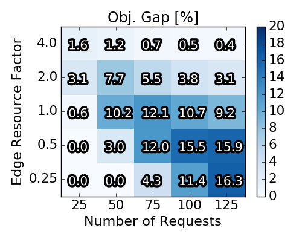 | 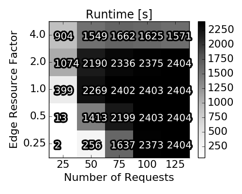 |
| 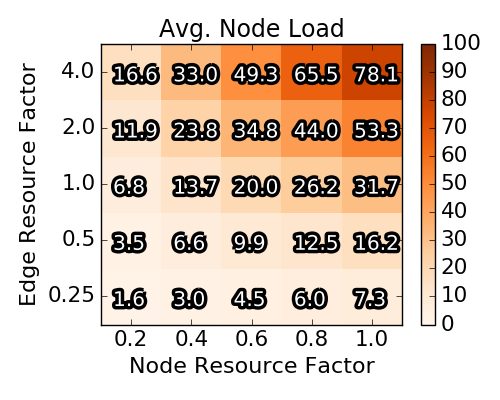 | 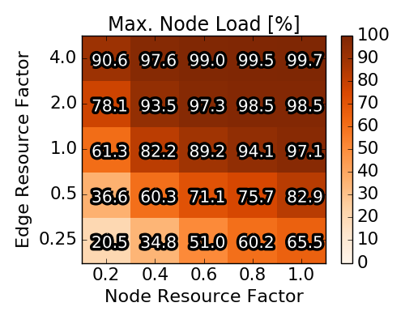 |
| 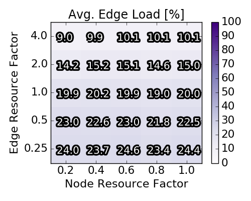 | 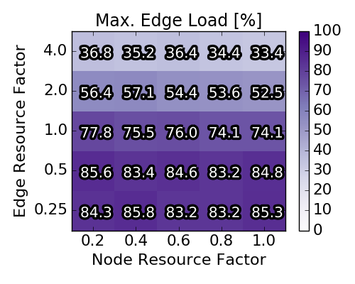 |

# Performance of Vanilla Rounding

We now investigate the performance of our randomized
rounding approach, and are particularly interested in the required
augmentation. Henceforth, the approach is called _vanilla_, to differentiate
it from the augmentation-free heuristics introduced later.
We compare the performance of the randomized rounding algorithm to the (near) 
optimal baseline solutions computed by the IP. Recall that the algorithm is 
formally parametrized by the factors α, β, and γ, such that 
a solution is only returned, if at least an α fraction of the optimal 
profit is achieved while augmenting node and edge resources by less than a 
factor β and γ respectively. In contrast to rather arbitrarily 
choosing these values, we simply perform 250 rounding operations and collect
these samples. From these, we select two solutions, namely (i) the one that did 
not exceed any resource capacities (or exceeded resource capacities the least), 
and (ii) the one that achieved the highest profit. If multiple solutions 
achieved the same profit or the same resource augmentation, we choose the one 
minimizing the augmentation respectively maximizing the profit.

The figure below shows the results of this experiment for 
all scenarios for which a solution could be computed. 
Considering the solutions minimizing the resource augmentation, we note that 
these seldomly induce a load of more than 200% of the original resource's 
capacity. Furthermore, for nearly all cases, these solutions reach at least 50% 
of the baseline profit. With respect to the solutions maximizing the profit, we 
observe resource augmentations of up to 450%, while _always_ yielding at 
least the profit of the baseline. 

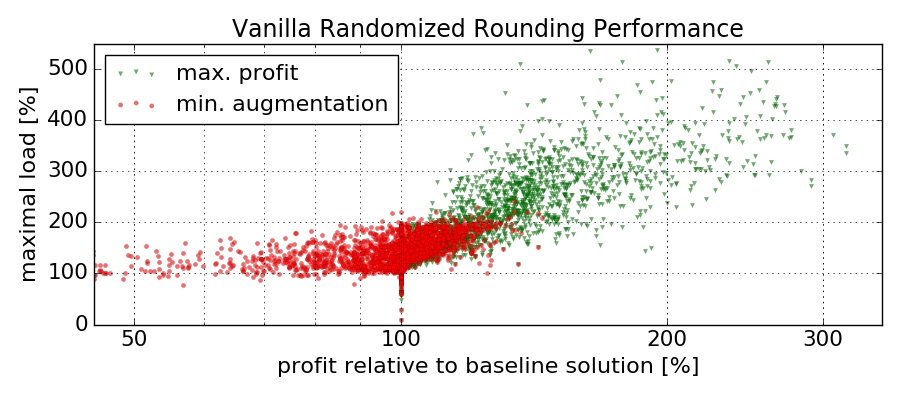

Out of 250 rounding operations, we depict for each scenario the one solution minimizing resource augmentations 
(and secondly achieving the highest profit) and the one solution achieving the 
maximal profit (and secondly minimizing the resource augmentation). The profits 
of each solution is normalized by the (baseline) profit achieved by the IP. A 
maximal load y larger than 100% implies that the solution exceeds any of the 
resources' capacities by y-100%.

# Augmentation-free Heuristics
While the above results are encouraging, there may be situations
in which augmentation is entirely unacceptable. Hence, we initiate
the study of augmentation-free algorithms, which fully respect the
substrate’s capacities. To this end, we propose 2 solutions:

__Augmentation-free rounding:__ We simply adapt the rounding
scheme to not accept any chosen mapping, which would violate
resource capacities. To increase the chance of finding diverse solu-
tions, the requests’ order is shuffled before each rounding iteration.

__Multi-Dimensional Knapsack:__ Instead of referring to round-
ing procedures, we also propose to optimally solve the rounding
problem. Concretely, instead of randomly choosing one (or none) of
the obtained mappings mkr to embed request r , we cast the optimal
selection of mappings as a Multi-Dimensional Knapsack (MDK)
problem. These types of problems are known to be relatively easy
to solve in practice (even though they are NP-hard). Concretely,
we introduce for each mapping mkr a decision variable xkr ∈ {0, 1},
such that (i) the capacities of the substrate are not exceeded and (ii)
for each request at most one of the mappings may be selected.
The figure below depicts the averaged achieved profit (relative to the
baseline solution computed by the IP). Interestingly, the average
performance of the augmentation-free rounding lies consistently
above 50%, even exceeding 90% under high edge capacities and
for a high number of requests. The MDK, as the optimal solution
to the rounding procedure, improves upon the augmentation-free
rounding procedure by roughly 4-6%.

# Runtime of the Algorithms

## Averaged (over 90 scenarios per square) relative performance of augmentation-free heuristics

<table><tr>
<td style="text-align:right">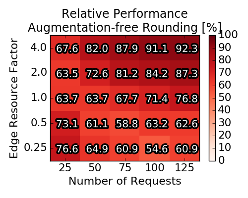</td>
<td style="text-align:left">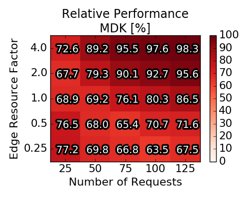</td>
</tr></table>

## Runtime for the three stages of execution of our approximation algorithm

|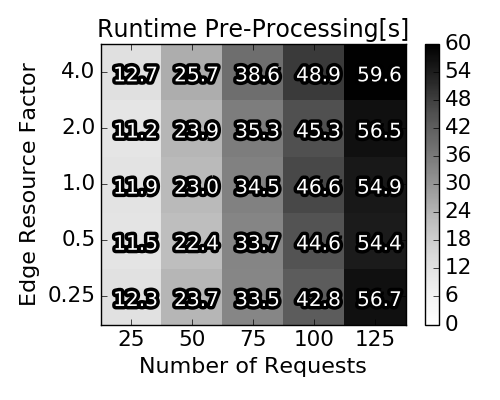 | 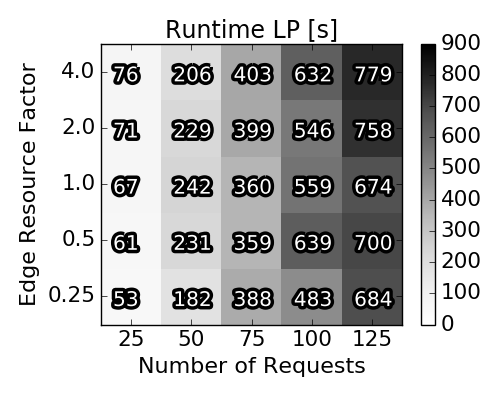 |
|----------------------:|-----------------------------------|
| 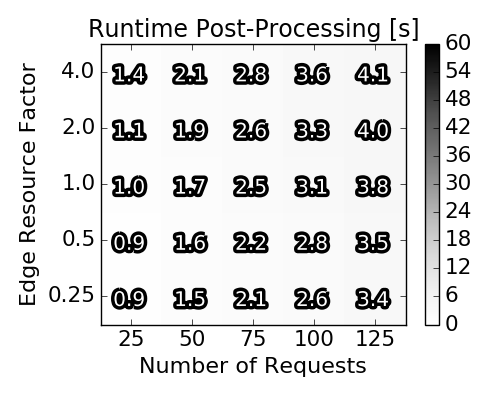 | 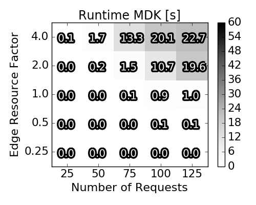 |
